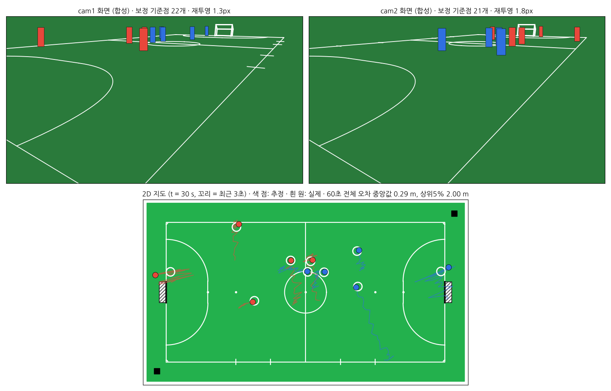

# futsal-analytics

일반 휴대폰 2대로 풋살 경기를 찍어서 **선수 위치를 2D 지도에 표시하고 이동거리·속도·히트맵을 계산**하는 시스템입니다. (AX 캡스톤 디자인)



## 무엇이 들어 있나

| 경로 | 내용 | 상태 |
|---|---|---|
| `src/futsal/` | 공용 라이브러리: FIFA 규격 코트, 카메라 모델, 호모그래피 보정, 두 카메라 병합, 지표, 오디오 동기화, `tracks.json` 포맷 | ✅ 테스트 있음 |
| `src/futsal/sim/` | 배치 시뮬레이터: 커버리지·정확도 지도, 배치 탐색, 합성 경기·합성 영상 | ✅ |
| `src/futsal/pipeline/` | 영상 → 선수 검출 → 경기장 좌표 → 병합 → 경기장 위 추적 → 지표 | ✅ 합성 영상으로 검증, YOLO 경로는 실제 영상 검증 필요 |
| `server/` | FastAPI 서버: 이어 올리기 업로드, 보정, 작업 큐, 결과 API | ✅ 테스트 있음 |
| `web/viewer/` | 2D 지도 웹 뷰어 (재생, 꼬리, 선수 기록, 히트맵) | ✅ |
| `docs/` | 설계·촬영 가이드·시뮬레이션 결과·로드맵 | |

## 빠른 시작

```bash
pip install -e ".[server,sim,dev]"        # 실제 영상 검출까지 하려면 ".[vision]" 추가 (GPU 권장)
pytest                                     # 전체 테스트

uvicorn server.app.main:app --reload       # http://localhost:8000 → 뷰어. "데모 경기 만들기"로 시뮬레이션 경기 확인
```

서버 없이 뷰어만 보려면: `python -m http.server -d web/viewer 8080` 후 `http://localhost:8080/?src=sample_tracks.json`

시뮬레이터:
```bash
python -m futsal.sim figures --court 40x20 --twist 5 --out docs/img   # 그림 3장
python -m futsal.sim twist --court 42x25                               # 그 구장에서 안전한 회전각
python -m futsal.sim accuracy --hfov 67.3                              # 합성 경기 위치 오차
python -m futsal.sim search --court 40x20                              # 두 대 배치 전수 탐색
```

## 문서
- [시스템 구조와 API](docs/architecture.md)
- [촬영 가이드 (설치 위치·각도·설정)](docs/capture-guide.md)
- [시뮬레이션 방법과 결과](docs/simulation.md)
- [로드맵과 다음 단계](docs/roadmap.md)
