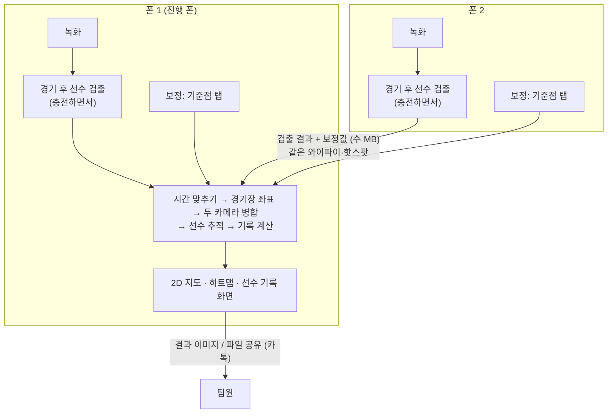

# 시스템 구조: 휴대폰에서 모두 처리

**운영 서버 없이** 촬영한 휴대폰 2대 안에서 분석까지 끝냅니다. 서버 비용(GPU, 영상 저장, 업로드 트래픽)을 0으로 만드는 것이 목표입니다.

## 한눈에 보기



- **영상(경기당 수 GB)은 폰 밖으로 나가지 않습니다.** 폰끼리는 검출 결과와 보정값(수 MB)만 주고받습니다.
- 무거운 작업은 **선수 검출** 하나뿐이고, 각 폰이 자기 영상을 처리합니다. 나머지는 가벼워서 진행 폰 한 대에서 몇 초~몇십 초면 끝납니다.

## 폰에서 다 되나? 단계별 정리

| 단계 | 어디서 | 계산량 | 비고 |
|---|---|---|---|
| 촬영 안내 (상대 폰 위치 표시, 높이·그물 체크) | 각 폰 | 가벼움 | 카메라 미리보기 위에 표시 |
| 녹화 | 각 폰 | – | 1080p 30fps, 경기 중에는 녹화만 (발열 방지) |
| 시계 맞추기 | 두 폰 | 가벼움 | 시작 전 QR로 연결할 때 서로 시각을 주고받아 차이를 기록. 소리 비교는 예비 수단 |
| **선수 검출** | 각 폰 | **무거움** | 경기 후 충전하면서. 아래 처리 시간 표 참고 |
| 보정 (기준점 탭) | 각 폰 | 가벼움 | 구장·삼각대 위치별로 한 번, 저장해서 재사용 |
| 결과 모으기 | 폰 2 → 폰 1 | 수 MB 전송 | 같은 와이파이·핫스팟에서 앱끼리 전송. 안 되면 파일로 공유 |
| 경기장 좌표 변환, 두 카메라 병합 | 폰 1 | 가벼움 | |
| 선수 추적, 끊긴 트랙 잇기 | 폰 1 | 가벼움 | 경기장 평면에서 추적해서 두 카메라에 걸쳐 ID 유지 |
| 팀 구분 (조끼 색) | 각 폰 | 가벼움 | 검출 박스 안의 색 분포로 분류 |
| 이동거리·속도·히트맵 | 폰 1 | 가벼움 | 칼만 스무딩 후 계산 |
| 결과 보기 · 공유 | 폰 1 | 가벼움 | 앱 화면, 결과 이미지·파일 공유 |

**결론: 운영에 필요한 처리는 모두 폰에서 됩니다.** 폰에서 하지 않는 것은 **개발 단계의 모델 학습과 변환** 하나뿐이고, PC나 무료 Colab에서 한 번 하면 됩니다(운영 비용 아님).

## 선수 검출 처리 시간 (예상)

50분 경기, 초당 10번 검출 = 폰 1대당 약 30,000프레임. 영상 디코딩·크기 조정 시간 포함 추정치입니다. **실제 폰에서 꼭 측정해야 합니다.**

| 폰 | 1프레임 (검출 + 디코딩) | 50분 경기 | 근거 |
|---|---|---|---|
| 최신 플래그십 (NPU/뉴럴엔진) | 약 10~20ms | **약 5~10분** | Galaxy S24(Snapdragon 8 Gen 3) NPU에서 YOLOv8 검출 약 3~5ms, M3 맥 CoreML 약 16ms |
| 중급형 (GPU 가속) | 약 40~80ms | 약 20~40분 | 추정 |
| 보급형 (CPU만) | 약 200~300ms | **약 1.5~2.5시간** | 보급형 안드로이드 YOLOv8n CPU 약 200~270ms |

멀리 있는 선수를 잘 잡으려고 화면을 2~4조각으로 나눠 검출하면(타일링) 시간도 2~4배 늘어납니다.

**느린 폰 대책** (앱이 기종 속도를 재서 자동으로 고르게 함)
1. **검출 간격 줄이기:** 초당 10번 대신 5번 검출하면 시간이 절반이 됩니다. 사이 구간은 추적이 메웁니다.
2. **빠른 폰이 두 영상을 모두 처리:** 같은 와이파이(5GHz)면 영상 3~6GB를 몇 분이면 옮길 수 있습니다.
3. **밤새 충전하면서 처리:** 결과는 다음 날 받습니다.

## 앱 구성 (Flutter, 아이폰·안드로이드 공통)

| 모듈 | 하는 일 | 사용 기술 |
|---|---|---|
| 촬영 | 미리보기 + 설치 안내 오버레이, 녹화, 시작 시각 기록 | camera 플러그인 |
| 짝짓기 | QR로 두 폰 연결, 시계 차이 측정, 경기 정보 공유 | 로컬 네트워크(같은 와이파이·핫스팟) |
| 검출 | 녹화 파일을 프레임 단위로 읽어 선수 검출 → 발 위치 픽셀 저장 | Ultralytics YOLO Flutter 공식 플러그인 (iOS CoreML / Android TFLite, 스냅드래곤 NPU 선택) |
| 보정 | 정지 화면 위에 기준점 탭 → 호모그래피 | 아래 "분석 코어" |
| 분석 코어 | 좌표 변환, 병합, 추적, 스무딩, 지표 | `src/futsal/`의 Python 코드를 Dart로 옮김 (약 500줄) |
| 결과 | 2D 지도 재생, 히트맵, 선수 기록, 이미지 내보내기 | `web/viewer/`를 웹뷰로 넣거나 Flutter로 다시 그림 |

## 폰 사이에 주고받는 데이터

| 파일 | 내용 | 크기 (50분) |
|---|---|---|
| `match.json` | 경기 ID, 구장 크기, 카메라 이름, 각 폰의 녹화 시작 시각(공통 시계 기준) | 1KB |
| `cam1.det.json`, `cam2.det.json` | 프레임 번호, 시각, 발 위치(u, v), 신뢰도, 팀 | 각 수 MB (압축하면 1~2MB) |
| `cam1.calib.json`, `cam2.calib.json` | 탭한 기준점, 호모그래피 행렬, 재투영 오차 | 1KB |
| `tracks.json` | 최종 결과: 선수별 10Hz 좌표 + 기록 | 수 MB |

형식은 지금 Python 코드와 같습니다(`src/futsal/pipeline/detect.py`, `src/futsal/homography.py`, `src/futsal/tracks.py`). 그래서 **폰에서 만든 파일을 PC의 Python 코드로 그대로 검증**할 수 있습니다.

### `tracks.json`

```json
{
  "version": 1, "court": {"length": 40, "width": 20}, "fps": 10, "start": 0, "n_frames": 30000,
  "players": [
    {"id": 1, "team": "A", "name": null,
     "stats": {"distance_m": 4210.5, "max_speed_ms": 6.8, "mean_speed_ms": 1.4, "sprints": 12, "seen_ratio": 0.97},
     "x": [12.31, 12.35, null, ...], "y": [5.02, 5.10, null, ...]}
  ]
}
```
좌표는 미터입니다. x는 터치라인 방향(0~길이), y는 골라인 방향(0~폭)이고, y=0이 벤치 쪽입니다. 안 보인 프레임은 `null`입니다.

## 결과 공유 (서버 없이)

| 방법 | 비용 | 받는 사람 |
|---|---|---|
| **결과 이미지** (2D 히트맵 + 선수 기록표) 카톡 공유 | 0 | 앱 없이 바로 봄 |
| `tracks.json` 파일 공유 | 0 | 앱이 있으면 2D 지도 재생 |
| (선택) 공유 링크 | 무료 범위 | 결과 파일(수 MB)만 무료 클라우드(Firebase 등)에 올리고, 뷰어는 GitHub Pages 같은 무료 정적 호스팅 |

## 저장소 코드의 역할

| 경로 | 역할 |
|---|---|
| `src/futsal/` | **기준 구현.** 앱의 분석 코어를 이 코드에서 옮기고, 같은 입력에 같은 출력이 나오는지 이 코드로 확인 |
| `src/futsal/sim/` | 배치·화각 시뮬레이션, 합성 경기·영상 (앱 테스트 데이터로도 사용) |
| `src/futsal/pipeline/` | PC에서 실제 영상을 처리해서 **정답 결과** 만들기. 앱 결과와 비교하는 데 씀 |
| `server/` | **개발용 PC 도구** (운영 서버 아님). 팀원이 PC에서 영상 올려 분석·확인할 때 사용 |
| `web/viewer/` | 2D 지도 뷰어. 앱 웹뷰에 넣거나 공유 링크용으로 사용 |

## 서버 대비 감수할 점

| 항목 | 영향 | 대응 |
|---|---|---|
| 작은 모델만 사용 (YOLO n/s급) | 먼 선수 검출률이 조금 낮을 수 있음 | 자체 영상으로 파인튜닝, 가능한 폰은 타일링 |
| 폰 성능 차이 | 보급형은 처리에 1시간 이상 | 검출 간격 자동 조정, 빠른 폰이 대신 처리 |
| 발열·배터리 | 처리 중 뜨거워짐 | 경기 후 충전하면서 처리, 녹화 중에는 녹화만 |
| 앱 개발량 | 카메라, 백그라운드 처리, 폰끼리 연결 | Flutter 공식 YOLO 플러그인으로 검출 부분 단순화 |
| 아이폰↔안드로이드 연결 | AirDrop·Nearby Share는 서로 안 됨 | 같은 와이파이·핫스팟에서 앱끼리 직접 전송 |
