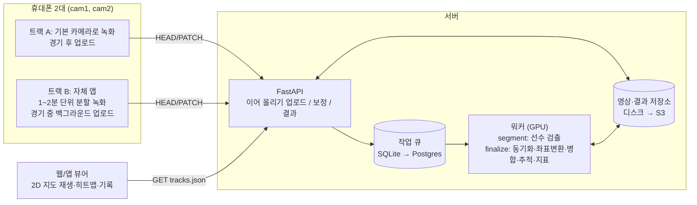

# 시스템 구조

## 한눈에 보기



**녹화 후 전송이 기본**이고, 트랙 B는 같은 API로 조각을 경기 중에 미리 올려서 결과를 빨리 받는 방식입니다. 실시간 스트리밍은 쓰지 않습니다(이유는 아래).

## 두 트랙이 같은 API를 쓰는 방법

| | 트랙 A (녹화 후 업로드) | 트랙 B (분할 업로드) |
|---|---|---|
| 촬영 | 폰 기본 카메라 | 자체 앱 (촬영 안내 오버레이, 분할 녹화) |
| 조각(segment) | 카메라당 1개 (`seq=0`) | `seq=0,1,2…` 순서대로 |
| 업로드 시점 | 경기 후 | 조각이 끝날 때마다 (와이파이가 있으면 경기 중) |
| 분석 시작 | 업로드 완료 후 | 조각이 도착할 때마다 검출 시작 |
| 결과 | 업로드 + 분석 시간 뒤 | 경기 직후 (마지막 조각 + finalize 시간) |

조각의 시작 시각 `t0`(그 카메라 녹화 시작 기준 초)는 보내도 되고, 안 보내면 앞 조각에 바로 이어진다고 봅니다.

## 처리 단계

| 단계 | 작업 | 코드 | 비고 |
|---|---|---|---|
| 1. 검출 | 3프레임마다(30fps → 10Hz) 사람 박스 → 발 위치(박스 아래 가운데) 픽셀 | `pipeline/detect.py` | YOLO(Ultralytics) 사전학습, 먼 선수용 타일링 옵션. 결과는 **픽셀**로 저장해서 보정을 나중에 해도 됨 |
| 2. 보정 | 사용자가 한 프레임에서 코트 기준점(최대 29개)을 탭 → 호모그래피 | `homography.py` | 6점 이상이면 RANSAC으로 잘못 탭한 점 제거, 재투영 오차(px) 반환 |
| 3. 동기화 | 두 영상의 소리로 시간차 추정 | `sync.py` | 신뢰도가 낮으면 0초로 보고, 클라이언트가 직접 보낼 수도 있음 |
| 4. 좌표 변환 | 픽셀 → 경기장 미터 좌표, 코트 밖(벤치·관중) 제거 | `pipeline/run.py` | 각 점에 불확실성(σ = 3px × m/px) 부여 |
| 5. 병합 | 같은 시각 두 카메라 점을 짝지어 역분산 가중 평균 | `fusion.py` | 가까운 카메라 쪽 값이 자동으로 더 반영됨 |
| 6. 추적 | 경기장 평면에서 ID 부여(등속 예측 + 최근접 매칭) → 끊긴 트랙 잇기 | `pipeline/pitch_tracker.py` | 카메라 하나에서 사라져도 다른 카메라가 보면 ID 유지 |
| 7. 지표 | 칼만+RTS 스무딩 후 이동거리·최고속도·스프린트·히트맵 | `metrics.py` | 흔들림을 걸러서 골키퍼처럼 느린 선수의 거리 과대 계산 방지 |

## API

| 메서드 | 경로 | 설명 |
|---|---|---|
| POST | `/api/matches` | 경기 생성 `{"court": "40x20", "title": "..."}` |
| GET | `/api/matches`, `/api/matches/{id}` | 목록 / 상태(조각, 보정, 작업, 오류) |
| HEAD | `/api/matches/{id}/cameras/{cam}/segments/{seq}` | 이어 올리기: 서버가 받은 바이트 수 `Upload-Offset` |
| PATCH | 같은 경로 | 헤더 `Upload-Offset: n` + 본문 바이트를 이어 붙임 (오프셋이 다르면 409) |
| POST | `…/segments/{seq}/complete` | 조각 완료 `{"t0": 초 또는 null}` → 검출 작업 등록 |
| GET | `/api/matches/{id}/cameras/{cam}/frame?t=1` | 보정 화면용 정지 화면(JPEG) |
| POST | `/api/matches/{id}/cameras/{cam}/calibration` | `{"taps": {"corner_bl": [u, v], ...}}` → 재투영 오차, 사용/제외된 점 |
| POST | `/api/matches/{id}/finish` | 최종 분석 `{"offsets": {"cam2": 1.2}}`(생략하면 소리로 동기화) |
| GET | `/api/matches/{id}/tracks` | 결과 `tracks.json` |
| GET | `/api/court?size=40x20` | 코트 라인·기준점 좌표 (보정 UI용) |
| POST | `/api/demo?seconds=300` | 시뮬레이션 경기 생성 (뷰어 개발용) |

`cam`은 `cam1`~`cam4`. 기준점 이름은 `GET /api/court`의 `keypoints` 참고.

## 데이터 포맷: `tracks.json`

```json
{
  "version": 1, "court": {"length": 40, "width": 20}, "fps": 10, "start": 0, "n_frames": 30000,
  "players": [
    {"id": 1, "team": "A", "name": null,
     "stats": {"distance_m": 4210.5, "max_speed_ms": 6.8, "mean_speed_ms": 1.4, "sprints": 12, "seen_ratio": 0.97},
     "x": [12.31, 12.35, null, ...], "y": [5.02, 5.10, null, ...]}
  ]
}
```
좌표는 미터, x는 터치라인 방향(0~길이), y는 골라인 방향(0~폭), y=0이 벤치 쪽. 안 보인 프레임은 `null`. 10명, 10Hz, 50분이면 압축 전 수 MB입니다.

## 저장 구조

```
data/futsal.db                                   경기·조각·보정·작업 메타데이터 (SQLite)
data/matches/<id>/<cam>/seg_0000.mp4             업로드된 영상
data/matches/<id>/<cam>/seg_0000.det.json        검출 결과 (픽셀)
data/matches/<id>/tracks.json                    최종 결과
```
`server/app/store.py`만 저장 위치를 알기 때문에, Postgres + S3로 바꿔도 API는 그대로입니다.

## 왜 실시간 스트리밍이 아닌가

| | 실시간 스트리밍 | 녹화 후 / 분할 업로드 |
|---|---|---|
| 네트워크 | 1080p 기준 폰 1대당 6~8Mbps를 경기 내내 유지해야 함. 실내 구장은 신호가 불안정한 곳이 많음 | 와이파이로 아무 때나, 끊기면 이어서 |
| 끊겼을 때 | 그 구간 데이터 영구 손실 | 영향 없음 |
| 화질 | 스트리밍 압축으로 낮아져 검출 성능 하락 | 원본 화질 |
| 경기 전체를 보는 후처리 | 불가능 | 가능 (ID 연결, 스무딩) |
| 서버 비용 | 경기 내내 GPU 대기 | 작업이 있을 때만 |

## 개발 → 운영

| | 지금 (개발·데모) | 운영 |
|---|---|---|
| API | `uvicorn server.app.main:app` 한 프로세스 | 같은 코드, 여러 인스턴스 |
| 워커 | API 안의 스레드 (`server/app/worker.py`) | 같은 `run_job`을 별도 GPU 프로세스(Celery/RQ 등)에서 실행 |
| DB | SQLite | Postgres |
| 영상 | 로컬 디스크 | S3 호환 저장소, 업로드는 presigned URL로 직접 |
| 검출기 | 테스트는 색 블롭 검출기, 실제는 YOLO | YOLO 파인튜닝 모델 |

## 아직 없는 것 (다음 단계)
- 팀 구분: 지금은 검출기가 팀을 주면 그대로 씀. 실제 영상은 **조끼 색 분류**가 필요
- 선수 이름 붙이기 UI, 수동 ID 수정 UI
- 보정 화면 UI (정지 화면 위에 기준점 탭) — API는 있음
- 검출 모델 파인튜닝, 외형 임베딩(Re-ID) 기반 ID 연결
- 인증, 경기 공유 링크
