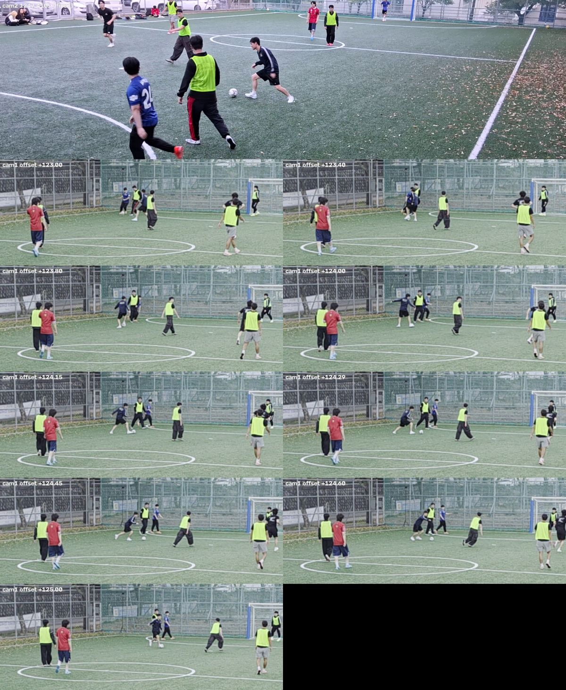
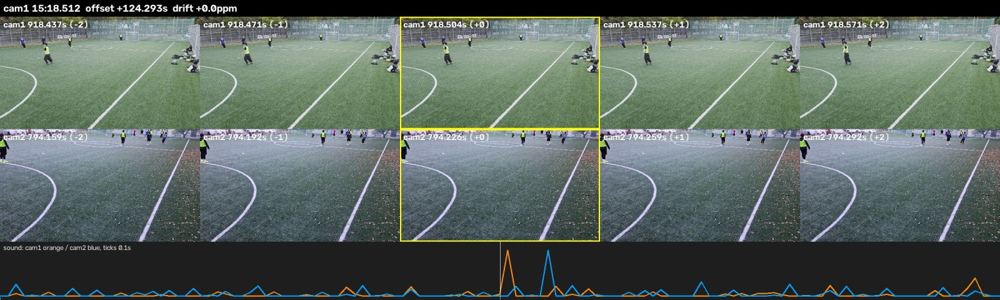
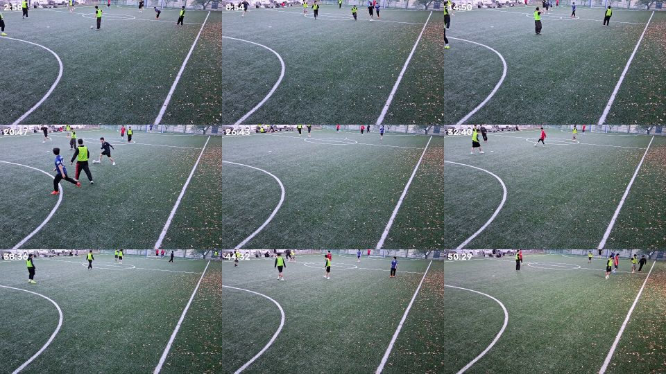
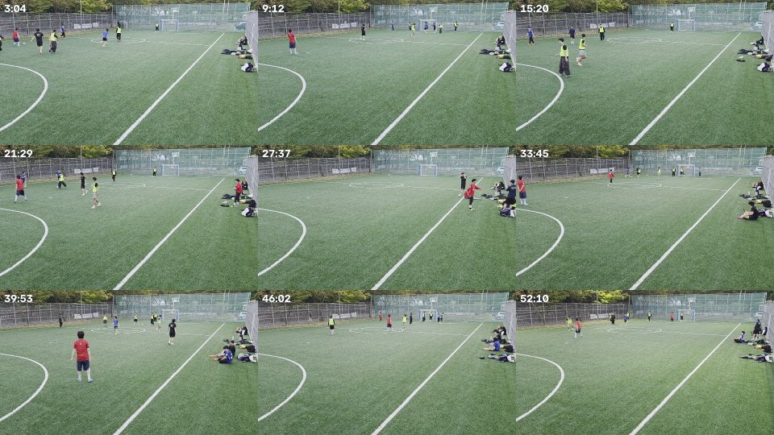

# 2026-10-08 테스트 촬영 기록

구장 40x20m, 대각선 코너 2대. 손뼉·휘슬·시계 화면 없이 경기 중에 녹화를 켰습니다.

| | cam1 (기준) | cam2 |
|---|---|---|
| 폰 | Galaxy S26 Ultra | Galaxy Buddy4 |
| 파일 | `20261008_170919.mp4` | `20261008_171122.mp4` |
| 형식 | 1080p **60fps**, 20.5Mbps | 1080p **30fps**, 17.2Mbps |
| 길이 | 55:14 (8.5GB) | 53:27 (6.9GB) |

원본 영상은 git에 없습니다 (팀 공유 드라이브에 올릴 것).

## 시간 맞추기 결과

```json
{"cam1": 0.0, "cam2": {"offset": 124.29, "drift": 0.0}}
```

**cam1 시각 = cam2 시각 + 124.29초.** 두 영상이 겹치는 구간은 약 53분입니다.

- 오차: 약 ±0.05초 (아래 소리 측정의 표준오차 0.02초 + 장면 확인)
- 시계 속도 차이(drift): 소리 측정으로는 전반 124.275초, 후반 124.305초로 약 +20ppm(50분에 0.03초)인데, 측정 오차 안이라 0으로 둡니다. 45~52분 구간을 1분씩 따로 재도 +124.06 ~ +124.31초로, 끝까지 벌어지지 않았습니다

## 카메라가 움직인 순간 (좌표 보정 주의)

영상 전체에서 화면이 갑자기 바뀐 순간을 찾아, 1초 전과 1.5초 후 화면이 얼마나 밀렸는지 쟀습니다 (1080p 기준 픽셀).

| 카메라 | 시각 (각 영상 기준) | 화면 이동 | 원인 | 처리 |
|---|---|---|---|---|
| cam1 S26 | **2:40** | x -41px, y -19px | 카메라 건드림 | 2:40 **이후** 화면으로 보정. cam2가 2:04에 켜져서 겹치는 구간 중 처음 36초만 이전 위치 |
| cam2 Buddy4 | **46:13** | x +14px | 카메라 건드림 | 먼 쪽에서는 1m 가까운 차이. **46:13 전후로 따로 보정** |
| cam1 S26 | 50:24 | 없음 (0.7px) | 밝기 125 → 141 (자동 노출) | 없음 |
| cam2 Buddy4 | 48:21 | 없음 | 밝기 108 → 116 (자동 노출) | 없음 |

나머지 큰 변화(cam2 1:05, 14:17, 16:44, 50:01)는 화면 이동이 없어 카메라 가까이를 지나간 선수 때문으로 보입니다.

### 영상 움직임으로 맞추기는 안 됨

두 영상의 프레임 차이(화면이 얼마나 변했는지)를 5분 구간별로 맞춰 봤지만 대부분 신뢰도 2~5로 쓸 수 없었습니다. 대각선 반대편에서 찍어서 같은 움직임도 두 화면에서 전혀 다르게 보이기 때문입니다.
45~52분 두 구간만 신뢰도 39로 **+123.09초**가 나왔는데, 위 표의 두 자동 노출 변화(cam2 48:21, cam1 50:24)가 맞물린 것입니다. 같은 햇빛 변화에 두 폰의 노출이 **1.2초 차이로** 반응한 것으로 보이며, 이런 사건은 시간 맞추기에 쓰면 안 됩니다. 같은 구간 소리 측정과 20분대 장면 비교 모두 +124.29초를 가리킵니다.

### 방법별 결과

| 방법 | 결과 | 판정 |
|---|---|---|
| 파일 이름 (17:09:19 / 17:11:22) | +123초 | 1초 단위라 대략값으로만 사용 |
| 메타데이터 `creation_time` | +123.0초 | **1.3초 틀림.** 삼성은 녹화 **종료** 시각을 초 단위로 기록. 종료 시각 − 길이로 계산 |
| `python -m futsal.sync` (기본값) | 시작 +101.6초 (신뢰도 5.0), 끝 +74.5초 (신뢰도 4.2), -8774ppm | **실패** |
| 소리, 123±5초 범위, 5분 구간 10개 | +124.0 ~ +124.4초 | 신뢰도 6 이상 7개 |
| 소리, 124.3±1.5초 범위, 1분 구간 53개 | 중앙값 **+124.293초**, 표준오차 0.02초 | 채택 |
| 장면 확인 (아래 그림) | +124.15 ~ +124.45초에서 일치, +123.0초는 불일치 | 채택값 확인 |

### 기본 `futsal.sync`가 실패한 이유

- 손뼉·휘슬이 없어서 시작·끝 2분 구간에 두드러진 소리가 없었습니다. 경기 소리(공 차는 소리, 말소리)는 비슷한 소리가 반복돼서, ±30초를 넓게 찾으면 엉뚱한 봉우리를 그럴듯한 신뢰도로 잡습니다.
- 두 폰 마이크가 약 45m 떨어져 있어서, 소리가 난 위치에 따라 두 폰에 도착하는 시각이 최대 **±0.13초** 달라집니다. 소리 하나하나로는 0.1초보다 정확히 맞출 수 없고, 코트 곳곳에서 난 소리를 여러 구간에서 재서 **중앙값**을 내야 이 차이가 상쇄됩니다.

→ `futsal.sync` 개선 방향: ① 메타데이터(종료 시각 − 길이)로 범위를 ±5초로 좁히기, ② 1분 구간 여러 개의 중앙값 쓰기. 영상 움직임으로 맞추는 방법은 대각선 배치에서 효과가 없었습니다 (아래 참고).

### 장면으로 확인

cam2 20:47(1247.4초)에 가까운 쪽에서 드리블하는 장면을 고정하고, cam1(먼 쪽 골대 앞)을 시간 차 후보별로 확대했습니다. +124.29초에서 공이 검은 옷 선수와 노란 조끼 사이에 떨어져 있는 배치가 cam2와 같고, +123.0초(메타데이터)는 선수 배치가 다릅니다.



`python -m futsal.syncview cam1.mp4 cam2.mp4 --offset 124.29` 는 겹치는 구간 5곳에서 같은 순간을 위(cam1)·아래(cam2)로 붙이고, 그 순간 앞뒤 1초의 소리 변화를 겹쳐 그립니다. 소리 봉우리가 0.1초쯤 어긋나는 건 위의 소리 도착 시간 차이 때문입니다.



## 영상 점검 (`python -m futsal.check`)

- **프레임 빠짐 없음.** 처음·중간·끝 모두 프레임 간격이 고릅니다 (cam1 60.04fps, cam2 30.0fps, 불규칙 0~0.2%).
- **밝기·선명도 정상.** 어두운 구간(밝기 60 미만) 없음. 밝기 cam1 130~137, cam2 110~114.
- **프레임 수가 다름 (60 / 30fps).** 분석은 시각 기준이라 문제없고, 검출은 초당 같은 횟수(`rate_hz`)로 맞춥니다.

## 다음 촬영에서 고칠 점

1. **cam2(Buddy4)를 위로 더 들기.** 화면 아래 70~85%가 빈 잔디이고, 선수는 맨 위 띠에 30~80px로 작게 나오며 먼 쪽 선수는 머리가 잘립니다. cam1처럼 펜스와 나무가 화면 위 1/4쯤 보이게 맞춥니다. 먼 선수 검출·ID 추적에 가장 큰 영향이 있습니다.

   
   

2. **시작·끝 손뼉 3번 + 시계 화면** ([촬영 가이드](capture-guide.md)). 있었으면 시간 맞추기가 바로 끝났습니다.
3. **두 폰 프레임 수 통일.** Buddy4가 60fps를 지원하면 둘 다 60fps, 아니면 둘 다 30fps.
