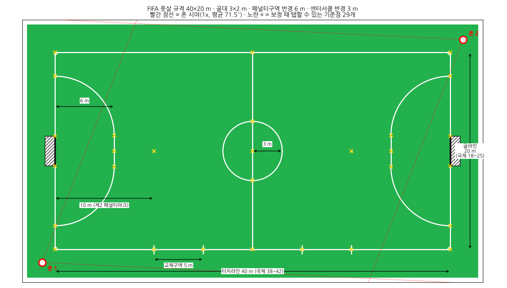

# 촬영 가이드

일반 휴대폰 2대 + 삼각대 2개 기준입니다. 근거는 [시뮬레이션 결과](simulation.md)에 있습니다.

## 설치

| 항목 | 권장 | 이유 |
|---|---|---|
| 위치 | **대각선 두 코너**, 라인 밖 약 1~1.5m (펜스 안쪽 런오프) | 1x 렌즈로 두 대가 가장 많이 보는 위치. 코트 둘레 모든 위치를 전수 탐색한 결과 1등 |
| 높이 | **2m 이상** (사람 키보다 높게) | 1.5m면 가까운 선수 머리가 잘리고 겹침이 늘어남 |
| 렌즈 | **1x** (0.5x가 있으면 더 좋음, 선택) | 1x는 모든 폰에 있음. 0.5x는 두 대가 코트 100%를 함께 봄 |
| 방향 | 서로 마주보게 놓고 **왼쪽으로 조금 돌림** → 상대 폰이 **화면 가운데에서 약간 오른쪽**에 보이게 | 두 대가 함께 보는 영역이 74% → 80%로 늘어남 |
| 화면 | 가로, 코트 네 모서리와 하프라인이 최대한 많이 보이게 | 보정 기준점이 많을수록 정확 |

### 구장 크기별 "상대 폰 위치" (화면 가로폭 기준, 왼쪽 0% ~ 오른쪽 100%)

| 구장 | 화각 좁은 폰 (아이폰 기본형 등) | 화각 넓은 폰 (갤럭시 S·Flip 등) |
|---|---|---|
| 30×15, 38×18, 40×20 | 약 57% (5° 회전) | 약 56% (5° 회전) |
| 42×25 (폭이 넓은 구장) | **약 53% (2° 회전)** | 약 56% (5° 회전) |

모르면 **정중앙(마주보기)**에 두세요. 어느 구장에서도 안 보이는 구역이 생기지 않습니다. 너무 많이 돌리는 쪽만 조심하면 됩니다. 정확한 값은 `python -m futsal.sim twist --court 가로x세로`로 계산합니다(앱에서는 자동 계산해서 표시할 예정).

## 휴대폰 설정

| 설정 | 값 |
|---|---|
| 해상도 / 프레임 | 1080p 이상, 30fps (4K 지원 폰은 4K 권장) |
| 손떨림 보정 | 일반 보정은 켜져 있어도 됨. **슈퍼 스테디·액션 모드는 끄기** (화면을 크게 잘라냄) |
| 초점·노출 | 코트를 길게 눌러 **고정 (AE/AF 잠금)** |
| 비행기 모드 | 켜기 (전화·알림으로 녹화가 끊기는 것 방지) |
| 배터리 / 저장공간 | 1080p 50분 ≈ 3~6GB. 보조배터리 연결 권장. **분석도 폰에서 하므로 경기 후 충전기 필요** |

## 시작 순서 체크리스트

1. 두 폰을 설치하고 위 방향대로 맞춘다 (앱 화면에 상대 폰 위치 표시가 나옴)
2. 앱에서 **QR로 두 폰 연결** (같은 와이파이나 한 폰의 핫스팟). 이때 두 폰의 시계 차이를 자동으로 잽니다
3. 두 폰 모두 녹화 시작
4. **코트 중앙에서 손뼉 한 번** (시간 맞추기 예비 수단. 시계 차이를 못 쟀을 때 소리로 맞춤)
5. 경기 (경기 중에는 녹화만 합니다. 분석을 같이 돌리면 발열로 녹화가 끊길 수 있음)
6. 끝나면 손뼉 한 번 더 → 녹화 종료
7. 각 폰에서 보이는 기준점 탭 (구장·삼각대 위치별로 한 번, 다음부터는 저장된 값 사용)
8. **두 폰 모두 충전기에 꽂고 분석 시작** → 폰 2의 검출 결과가 폰 1로 전송 → 폰 1에서 결과 확인·공유

분석 시간은 폰에 따라 5분(최신 플래그십)부터 1~2시간(보급형)까지 걸립니다. 자세한 건 [시스템 구조](architecture.md#선수-검출-처리-시간-예상) 참고.

## 측정 정확도 평가용 (테스트 촬영 때만)

- 코트 안 정해진 위치(예: 페널티 마크, 센터, 코너에서 5m 지점)에 **콘이나 사람**을 세우고 줄자로 실제 좌표를 기록
- 그 위치에 서서 5초씩 머무르기 → 추정 좌표와 비교
- 실제 구장의 라인 크기를 줄자로 재서 기록 (규격과 다를 수 있음)
