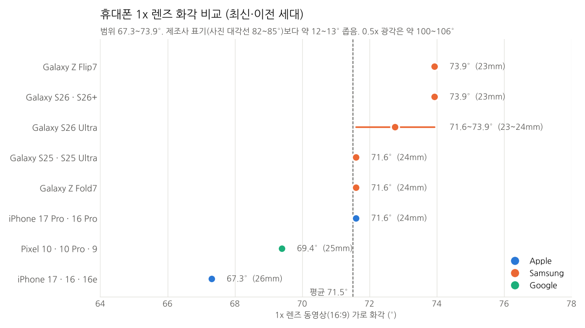
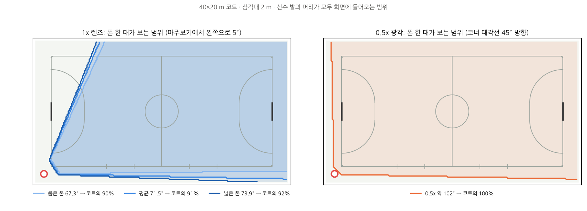
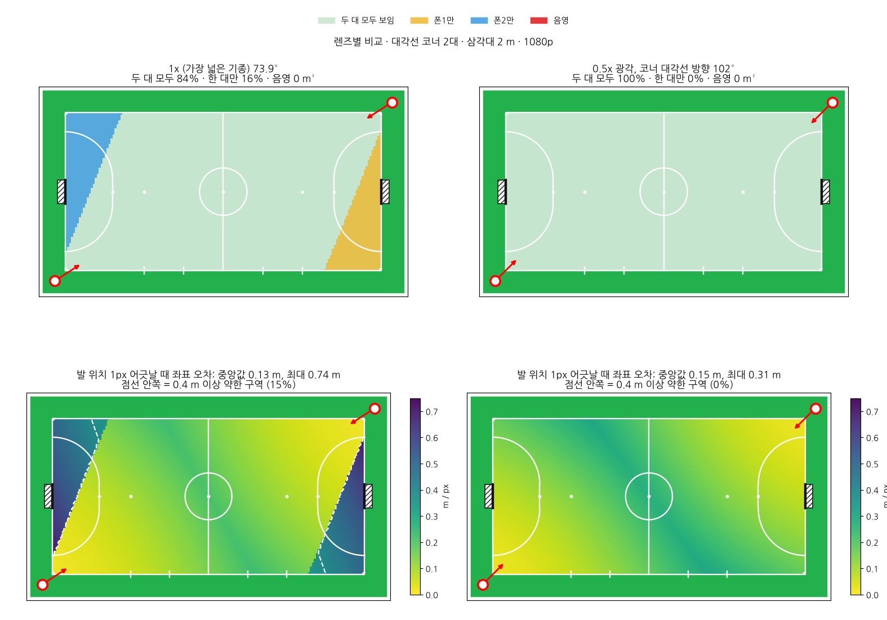

# 배치 시뮬레이션

실제 영상을 찍기 전에 **휴대폰을 어디에, 어떤 각도로 두면 얼마나 정확한지**를 계산으로 확인한 결과입니다. 코드: `src/futsal/sim/`.

## 가정

| 항목 | 값 |
|---|---|
| 코트 | FIFA 풋살 규정 Law 1: 40×20m, 골대 3×2m, 페널티 구역(골포스트 바깥 기준 반지름 6m 1/4원 + 3.16m 직선), 페널티 마크 6m, 제2 페널티 마크 10m, 센터서클 반지름 3m, 교체 구역 5m |
| 카메라 | 핀홀 모델, 1080p, 삼각대 2m, 라인 밖 1.3m. 화면 위쪽 끝이 수평선보다 2° 위 (먼 선수 머리가 잘리지 않게) |
| 1x 화각 (16:9 동영상 가로) | 67.3°(26mm, 아이폰 기본형) ~ 73.9°(23mm, 갤럭시 S26·Flip7), 평균 71.5° |
| "보인다" | 선수(1.75m)의 발과 머리가 모두 화면 안 |
| 보정 | 화면에 보이는 기준점(최대 29개)을 ±2px 오차로 탭 |
| 검출 | 발 위치 ±3px 흔들림 |

렌즈 왜곡, 조명, 가려짐은 모델에 없습니다. **실제 영상으로 다시 확인해야 하는 숫자**입니다.

### 1x 렌즈 화각 (35mm 환산 초점거리에서 계산)

| 기종 | 환산 초점거리 | 동영상 가로 화각 |
|---|---|---|
| iPhone 17 Pro, 16 Pro | 24mm | 71.6° |
| iPhone 17, 16, 16e | 26mm | 67.3° |
| Galaxy S26 / S26+, Z Flip7 | 23mm | 73.9° |
| Galaxy S26 Ultra | 23~24mm (자료마다 다름) | 72~74° |
| Galaxy S25 / S25 Ultra, Z Fold7 | 24mm | 71.6° |
| Pixel 9 / 10 | 25mm | 69.4° |

제조사가 쓰는 85°, 82° 같은 숫자는 사진 대각선 화각이라 동영상 가로 화각보다 12~13° 큽니다.



### 폰 한 대가 보는 범위

1x는 코너에서 코트의 90~92%를 담고, 카메라 쪽 옆 사이드라인 근처는 못 봅니다(반대편 폰이 담당). 0.5x는 한 대로 코트 100%를 담습니다.



### 렌즈별 두 대 배치 비교



## 결과 1: 두 대를 어디에 둘까 (1x)

코트 둘레 위치(2m 간격)와 방향(4° 간격)을 모두 조합해서 계산했습니다(`python -m futsal.sim search`).

| 배치 (각도는 각각 최적) | 안 보이는 곳 없음 | 두 대 모두 보는 영역 | 1px당 오차 상위 5% |
|---|---|---|---|
| **대각선 코너 (추천)** | ✓ | **80~86%** | **0.51~0.53m** |
| 같은 긴 변의 두 코너 | ✓ | 80~86% | 0.57~0.62m |
| 양쪽 끝선, 골대 옆 4m | ✓ | 67~71% | 0.53~0.58m |
| 같은 짧은 변의 두 코너 | 거의 | 49~60% | 0.54~0.59m |
| 한쪽 긴 변 1/4 지점 두 곳 | ✓ | 25~31% | 0.35~0.38m |
| 양쪽 긴 변 중앙 | ✗ (13~18% 못 봄) | 0% | – |

## 결과 2: 추천 배치의 커버리지와 정확도


| | 화각 좁은 폰 (67°) | 화각 넓은 폰 (74°) |
|---|---|---|
| 안 보이는 곳 | 0m² | 0m² |
| 두 대 모두 보는 영역 | 80% | 84% |
| 1px당 오차 중앙값 / 최대 | 0.12m / 0.67m | 0.13m / 0.74m |
| 0.4m/px 이상인 약한 구역 | 15% | 15% |

**약한 구역**은 카메라가 없는 두 코너 쪽입니다. 그쪽은 멀리 있는 폰 하나만 보기 때문에, 가려지면 보완할 카메라가 없고 오차도 큽니다. 두 골대 앞 일부가 여기에 걸려서 **골키퍼 위치가 상대적으로 덜 정확**합니다.

- 0.5x 광각(약 100~106°)을 쓰면 두 대가 코트 100%를 함께 보고 최대 오차가 약 0.3m/px로 줄어듭니다.
- 마주보기(회전 0°)는 모든 구장 크기에서 안 보이는 곳이 없지만, 두 대가 함께 보는 영역이 74~78%로 줄어듭니다.
- 폭이 넓은 구장(42×25)은 화각 좁은 폰에서 2°까지만 돌려야 안 보이는 곳이 안 생깁니다.

## 결과 3: 합성 경기로 끝까지 돌려보기


합성 경기(10명, 사람다운 속도) → 두 폰 화면에 투영 + 흔들림 → 탭 보정 → 경기장 좌표 → 병합. 5분 기준 결과입니다(`python -m futsal.sim accuracy`).

| | 화각 좁은 폰 | 화각 넓은 폰 |
|---|---|---|
| 보정 재투영 오차 | 약 2px | 약 2px |
| 프레임당 위치 오차 중앙값 | 0.29m | 0.32m |
| 평균 / 상위 5% | 0.53m / 2.1m | 0.57m / 2.2m |

상위 5% 오차는 대부분 약한 구역(골대 근처 코너)에서 나옵니다. 이동거리·속도는 칼만 스무딩 후 계산해서, 같은 합성 경기에서 **필드 선수 이동거리 오차 1% 이내, 골키퍼 +10%, 최고속도 ±0.7m/s** 수준입니다.

### 합성 영상으로 PC 파이프라인 전체 검증

`tests/test_server.py`는 합성 영상(색 박스 선수)을 만들어 개발용 PC 도구의 API로 업로드 → 보정 → 검출 → 병합 → 추적까지 돌립니다. 30초 합성 경기에서 트랙 12개(실제 10명)가 나오고, 같은 팀 선수끼리 교차할 때 ID가 바뀌는 경우가 있습니다. **ID 안정화(외형 특징, 전역 연결)가 실제 영상에서 가장 먼저 개선할 부분**입니다.

## 결과 4: 선수 ID 추적 (생김새 특징 사용 전후)

합성 경기에서 선수마다 **같은 팀 조끼 + 각자 다른 바지 색 + 다른 키**를 주고(바지 색이 겹치는 선수도 있음), 두 폰 합성 영상 → 검출 → 병합 → 추적까지 돌려 정답과 비교했습니다(`python -m futsal.sim idtest`, 경기 2분, 10명).

| 방식 | IDF1 (seed 5 / 6 / 7) | 나온 트랙 수 (10명) |
|---|---|---|
| 이전: 움직임만 사용 | 0.24 / 0.25 / 0.26 | 51 / 51 / 37 |
| **개선: 생김새 + 경기 전체 다시 묶기** | **0.53 / 0.58 / 0.68** | 50 / 32 / 28 |

IDF1은 "전체 경기 동안 맞는 ID로 추적된 비율"입니다(1이 완벽).

**개선 방식**
1. 검출할 때 박스마다 **상체·하체 색 분포**를 저장합니다. 조끼는 팀 안에서 같으니 하체(바지) 비중을 크게 둡니다. 너무 작거나 두 명이 겹친 박스는 색을 쓰지 않습니다.
2. 경기장 평면에서 추적하되, **헷갈리는 순간**(같은 팀 두 명이 가까울 때, 박스가 합쳐질 때)에는 이어 붙이지 않고 짧은 조각으로 끊습니다.
3. 경기가 끝난 뒤 조각들을 **색이 비슷하고, 시간이 겹치지 않고, 그 사이에 달려갈 수 있는 거리**인 것끼리 한꺼번에 다시 묶습니다.
4. 같은 선수를 두 카메라가 따로 잡아 생긴 **중복 트랙**을 합칩니다.

**아직 부족한 점 (다음 단계)**
- 2분에 트랙이 28~50개로, 여전히 쪼개집니다. 원인은 겹친 박스로 인한 검출 누락(합성 기준 약 1/3)과 먼 쪽 위치 오차입니다.
- 다음에 넣을 단서:
  - **키**: 박스 높이와 카메라 보정값으로 미터 단위 키를 계산
  - **팀 자동 분류**: 실제 영상에서 조끼 색을 묶어서 팀을 나눔
  - **경량 Re-ID 모델**: 헷갈리는 순간에만 실행
  - **앱에서 사용자 확인**: 헷갈린 장면 몇 개만 보여 주고 탭으로 확인
- 합성 영상은 색이 단순해서, **실제 영상 3~5분을 직접 라벨링해서 다시 재야** 진짜 정확도를 알 수 있습니다.

## 다시 계산하기

```bash
python -m futsal.sim figures --court 40x20 --twist 5 --out docs/img
python -m futsal.sim fov --court 40x20 --twist 5 --out docs/img       # 화각 그림 3장
python -m futsal.sim coverage --court 38x18 --twist 5 --hfov 67.3
python -m futsal.sim twist --court 42x25
python -m futsal.sim search --court 40x20 --hfov 67.3
python -m futsal.sim accuracy --court 40x20 --hfov 71.5 --seconds 300
python -m futsal.sim idtest --court 40x20 --seconds 120 --seed 5    # ID 추적 점수 (약 1분 걸림)
```
