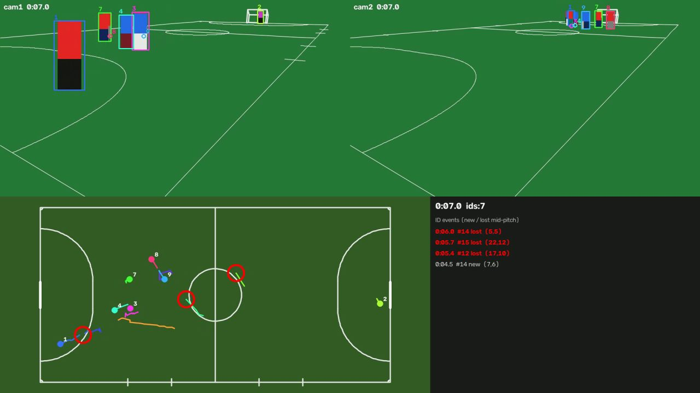

# 추적 결과 영상 만들기 (실제 영상)

실제 촬영 영상 두 개로 **선수 검출 → 두 카메라 병합 → 추적**을 돌리고, 결과를 눈으로 확인하는 영상을 만듭니다. 추적·ID 개선의 출발점입니다.



- **위:** 두 카메라 화면. 박스 색과 번호가 같으면 같은 선수(ID)입니다. 회색 얇은 박스는 검출됐지만 추적에 안 쓰인 것이고, 박스 없이 동그라미만 있으면 다른 카메라에서만 보인 선수입니다.
- **아래 왼쪽:** 2D 지도와 최근 2초 이동 경로입니다.
- **아래 오른쪽:** 경기장 한가운데서 ID가 **새로 생기거나(new) 끊긴(lost)** 순간 목록입니다. 사이드라인·골라인 근처가 아닌 곳에서 ID가 생기거나 끊기면 대부분 ID가 바뀐 것입니다. 해당 순간에 지도에 동그라미가 깜빡입니다.

## 준비

```powershell
pip install -e ".[vision]"      # YOLO (처음 실행 때 yolo11s.pt 자동 다운로드)
```

## 1. 기준점 탭 (카메라마다 한 번)

```powershell
python -m futsal.calibtool frame C:\Users\user\dev\futsal-videos\20261008_170919.mp4 --at 600 --camera cam1 --out calib\cam1
python -m futsal.calibtool frame C:\Users\user\dev\futsal-videos\20261008_171122.mp4 --at 600 --camera cam2 --out calib\cam2
```

1. `calib\cam1\tap.html`을 브라우저로 엽니다.
2. 오른쪽 코트 그림의 **빨간 점**이 영상 어디인지 찾아 클릭합니다. 안 보이면 "안 보임"을 누릅니다. 오른쪽 아래 확대 화면을 보면서 선이 만나는 점을 정확히 찍으세요.
3. **6개 이상, 화면 곳곳에서** 찍고 "저장"을 누릅니다. 다운로드된 `taps.json`을 `calib\cam1\`로 옮깁니다.
4. 보정값을 만듭니다.
   ```powershell
   python -m futsal.calibtool fit calib\cam1\taps.json
   ```
   - 재투영 오차가 **5px 이하**면 좋습니다.
   - `calib\cam1\check.jpg`에서 **빨간 선이 코트 선 위에 겹치는지** 확인합니다. 어긋난 곳이 있으면 그 근처 점을 다시 찍습니다.
   - "코트가 화면에 보이는 비율"과 "카메라를 위로 드세요" 같은 안내도 나옵니다.

**방향 약속:** 위에서 본 코트에서 **cam1은 왼쪽 아래 모서리, cam2는 오른쪽 위 모서리**에 있습니다. 두 폰 모두 "내 폰 바로 앞 모서리에서 **골대가 있는 짧은 선은 화면 왼쪽**으로, **긴 사이드라인은 화면 오른쪽**으로" 뻗습니다. 두 카메라가 이 약속을 똑같이 지켜야 두 화면의 선수가 같은 자리에 겹칩니다.

**탭할 프레임 고르기:** 카메라가 움직였다면 그 뒤 프레임을 고릅니다. 10/8 영상은 cam1이 2:40에, cam2가 46:13에 움직였으니 둘 다 10:00(600초)이면 됩니다.

## 2. 추적 결과 영상

```powershell
python -m futsal.trackview --video C:\Users\user\dev\futsal-videos\20261008_170919.mp4 C:\Users\user\dev\futsal-videos\20261008_171122.mp4 `
    --calib calib\cam1\calib.json calib\cam2\calib.json --offset 0 124.27 --start 600 --duration 180 --out trackview
```

| 옵션 | 뜻 |
|---|---|
| `--offset 0 124.27` | 카메라별 시간 차 (cam1 = 0, cam2 = `futsal.sync` 결과) |
| `--start 600 --duration 180` | cam1 영상 10:00부터 3분 |
| `--auto-moves` | 카메라가 움직인 순간을 자동으로 찾아 보정 (영상 전체를 훑어서 몇 분 더 걸림). 구간 안에 카메라가 움직였으면 사용 |
| `--rate 10` | 초당 검출 횟수. 느리면 5 |
| `--model yolo11n.pt` | 더 빠르지만 먼 선수를 더 놓치는 모델 |
| `--ids v2` | 추적 방식 (기본 `v2`: 카메라별 조각 → 두 카메라 짝짓기 → 5대5 정원 배정). `appearance`는 예전 방식 |
| `--no-reid` | 사람 재식별(ReID) 계산을 건너뛰고 예전 방식으로 추적. ReID가 설치되지 않았으면 자동으로 이렇게 됩니다 |
| `--conf 0.1` | 검출 신뢰도 하한. 기본은 `v2`면 0.1, 예전 방식이면 0.3 |

**ReID 설치 (v2에 필요):** `pip install -e ".[reid]"` 다음에 `pip install --no-deps boxmot`. GPU용 torch 설치 순서는 `src/futsal/pipeline/reid.py` 맨 위 설명을 보세요.

**처리 시간:** 검출이 대부분입니다. 3분 × 초당 10번 × 2대면 3,600장입니다. GPU가 없으면 수십 분 이상 걸릴 수 있으니 **먼저 `--duration 30`으로 시험**해 보세요. 검출 결과는 `det_cam1.json`에 저장되고, 같은 설정으로 다시 돌리면 검출을 건너뛰고 영상만 다시 만듭니다.

결과 (`trackview` 폴더):

| 파일 | 내용 |
|---|---|
| `trackview.mp4` | 확인용 영상 (1920×1080, 초당 10장) |
| `events.csv` | ID가 경기장 한가운데서 생기거나 끊긴 순간 (엑셀로 열림) |
| `tracks.json` | 선수별 위치. 2D 지도 뷰어(`web/viewer`)로 재생 |
| `det_cam1.json`, `det_cam2.json` | 검출 결과 (다시 돌릴 때 재사용). ReID 특징은 옆의 `det_cam1.json.reid.npy` |

## 3. 볼 것

1. **위치가 맞는지:** 두 카메라에서 같은 선수에게 같은 번호가 붙는지 봅니다. 번호가 다르면 보정(기준점)이나 시간 차를 의심합니다.
2. **ID가 바뀌는 순간:** `events.csv`의 시각으로 가서, 그 순간 무슨 일이 있었는지 적습니다. 예: 겹침, 화면 밖, 먼 쪽이라 검출 놓침, 같은 팀끼리 교차.
3. **ID 개수:** 선수가 10명인데 ID가 훨씬 많으면 끊김이 많은 것입니다. 구간 절반 이상 보인 ID 개수도 함께 출력됩니다.

이렇게 모은 "ID가 바뀌는 상황" 목록이 추적·ID 개선의 우선순위가 됩니다. 정확한 점수(IDF1)를 내려면 다음 단계로 같은 구간의 정답 ID를 라벨링합니다.
