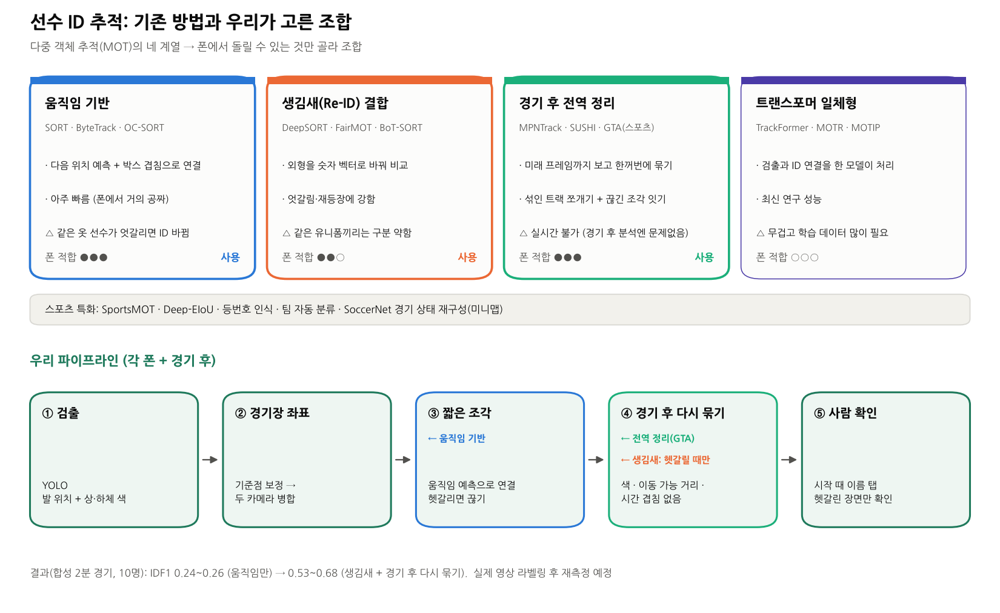

# 선수 ID 추적: 기존 방법 조사와 우리 선택

여러 대상을 동시에 따라가며 ID를 유지하는 기술을 **다중 객체 추적(MOT, Multi-Object Tracking)**이라고 합니다. 사람, 차량, 스포츠 선수 추적이 모두 여기에 속합니다.

## 1. 움직임 기반 ("검출 후 연결"의 기본형)

매 프레임 검출한 박스를 이전 프레임의 박스와 짝지어 ID를 이어 갑니다.

| 방법 | 연도 | 핵심 아이디어 |
|---|---|---|
| SORT | 2016 | 칼만 필터로 다음 위치를 예측하고, 박스가 겹치는 정도(IoU)로 짝짓기 |
| ByteTrack | 2021~22 | 확신도가 낮은 박스(가려진 사람)도 2차로 짝지어서 끊김을 줄임. Ultralytics YOLO에 기본 내장 |
| OC-SORT | 2022~23 | 가려졌다 다시 나타날 때 예측 오차를 실제 관측으로 보정. 방향이 갑자기 바뀌는 움직임에 강함 |
| Hybrid-SORT 등 | 2024 | 박스 높이·확신도 같은 약한 단서까지 활용 |

- 장점: 아주 빠릅니다. 폰에서도 계산 비용이 거의 없습니다.
- 단점: **같은 옷을 입은 사람이 엇갈리면 ID가 바뀝니다.**

## 2. 생김새(Re-ID) 결합

외형을 숫자 벡터로 바꾸는 작은 신경망(Re-ID)으로 "같은 사람인지"를 비교합니다.

| 방법 | 연도 | 핵심 아이디어 |
|---|---|---|
| DeepSORT | 2017 | SORT + Re-ID 신경망 |
| FairMOT / JDE | 2020 | 검출과 외형 벡터를 한 네트워크에서 같이 뽑아 빠르게 처리 |
| BoT-SORT / StrongSORT | 2022 | 카메라 흔들림 보정 + 강한 Re-ID. 여러 벤치마크 상위권 |
| Deep OC-SORT | 2023 | OC-SORT + 외형 |

- Re-ID 모델은 OSNet 같은 경량 모델을 많이 씁니다.
- 단점: **같은 유니폼을 입은 선수끼리는 외형 구분이 약합니다.** 그래서 스포츠는 따로 연구됩니다.

## 3. 경기 후 전역 정리 (오프라인)

실시간이 아니면 미래 프레임까지 보고 한꺼번에 정리할 수 있어서 정확도가 크게 올라갑니다.

| 방법 | 연도 | 핵심 아이디어 |
|---|---|---|
| 최소 비용 흐름(그래프) | 2008~ | 모든 검출을 그래프로 놓고 전체 비용이 최소인 경로들을 한 번에 찾기 |
| MPNTrack | 2020 | 그래프 신경망으로 같은 사람끼리의 연결을 학습 |
| SUSHI | 2023 | 짧은 구간에서 긴 구간 순서로 단계적으로 묶기 |
| GTA (Global Tracklet Association) | 2024 | **스포츠용 후처리.** 섞인 트랙은 쪼개고 끊긴 조각은 이음. 어떤 추적기 뒤에든 붙일 수 있음 |

## 4. 트랜스포머 일체형 (최신 연구)

| 방법 | 연도 | 특징 |
|---|---|---|
| TrackFormer, MOTR | 2022 | 검출과 ID 연결을 하나의 트랜스포머가 처리 |
| MOTRv2, MeMOTR | 2023 | 성능 개선, 장기 기억 추가 |
| MOTIP | 2025 | ID 부여를 분류 문제로 학습 |
| SAM2 기반 추적기 | 2024~25 | 범용 분할 모델의 기억 기능을 추적에 활용 |

정확도는 좋지만 **무겁고 학습 데이터가 많이 필요해서** 폰 처리에는 맞지 않습니다.

## 5. 스포츠 선수 특화

선수 추적이 어려운 이유는 **같은 유니폼, 빠르고 급한 방향 전환, 잦은 겹침**입니다.

| 기술 | 내용 |
|---|---|
| SportsMOT 데이터셋 (2023) | 농구·축구·배구 추적 벤치마크. 함께 제안된 MixSort는 외형 특징을 강화한 방식 |
| Deep-EIoU (2024) | 빠른 움직임에 맞게 박스를 넓혀서 짝지음. SportsMOT·SoccerNet 대회 상위권 |
| 등번호 인식 | 숫자를 읽어 개인을 식별. SoccerNet 등번호 대회(2023~), 문자 인식 모델(PARSeq 등) |
| 팀 자동 분류 | 선수 이미지 특징 벡터를 군집화해서 두 팀으로 나눔 (예: Roboflow sports의 SigLIP 특징 + 군집화) |
| SoccerNet 경기 상태 재구성 (2024) | 방송 영상 → 미니맵 위 선수 위치 + 팀 + 등번호 + 역할. **우리 목표와 가장 비슷한 과제** |
| 착용 장비 | GPS·UWB 조끼(Catapult, Kinexon 등). 실내에서는 GPS가 안 되고, 동호인에게는 비쌈 |

## 6. 차량과 여러 카메라

| 분야 | 방법 |
|---|---|
| 차량, 카메라 1대 | ByteTrack·DeepSORT + 차량용 Re-ID(차종, 색) |
| 차량 고유 ID | 번호판 인식이 가장 확실 |
| 차량, 여러 카메라 | AI City Challenge(CityFlow 데이터셋): Re-ID + 카메라 간 이동 시간·도로 연결 관계 제약 |
| 사람, 여러 카메라 | WILDTRACK 데이터셋, MVDet(2020)·EarlyBird(2024): 여러 카메라를 **바닥 평면**에 합쳐서 검출·추적 |

**우리 방식**(각 폰 검출 → 바닥 좌표로 변환 → 병합 → 바닥 평면에서 추적)은 여러 카메라 사람 추적의 "바닥 평면 병합" 계열입니다.

## 7. 평가 지표

| 지표 | 의미 |
|---|---|
| MOTA | 놓침·잘못 검출·ID 바뀜을 합친 지표. 검출 성능의 영향이 큼 |
| **IDF1** | 경기 내내 맞는 ID로 추적된 비율. **ID 유지 평가에 가장 적합** (우리가 쓰는 지표, `futsal.sim.evaluate`) |
| HOTA | 검출과 연결을 균형 있게 보는 최신 표준 |

## 8. 우리 선택

| 단계 | 쓰는 기술 | 이유 | 상태 |
|---|---|---|---|
| 프레임 간 연결 | 움직임 기반 (ByteTrack/OC-SORT 아이디어) + **헷갈리면 끊기** | 폰에서 계산 비용이 거의 없음 | ✅ `pitch_tracker.tracklets` |
| 생김새 | 상체·하체 색 분포 → 필요하면 **경량 Re-ID를 헷갈리는 순간에만** | 폰 부담 최소화 | ✅ 색 분포 / ⏳ Re-ID |
| 경기 후 정리 | GTA 방식의 전역 다시 묶기 + 두 카메라 중복 합치기 | 오프라인이라 정확도 이득이 큼 | ✅ `pitch_tracker.associate` |
| 팀 구분 | 조끼 색 군집화 | 학습 없이 경기마다 자동 | ⏳ |
| 키 | 박스 높이 + 보정값 → 미터 단위 키 | 한 사람의 키는 경기 내내 같음 | ⏳ |
| 개인 확정 | 경기 시작 때 이름 탭 + 헷갈린 장면만 사용자 확인 | 자동 90% + 사람 10%로 실사용 수준 | ⏳ 앱 |

**현재 결과** (합성 2분 경기, 10명): IDF1 0.24~0.26 (움직임만) → **0.53~0.68** (생김새 + 경기 후 다시 묶기). 자세한 건 [시뮬레이션 결과 4](simulation.md#결과-4-선수-id-추적-생김새-특징-사용-전후)에 있습니다.

**검토할 아이디어: 번호 조끼.** 등번호 인식은 이미 검증된 기술이라, 숫자가 크게 적힌 조끼(장당 수천 원)를 쓰면 숫자를 읽는 것만으로 ID 문제 대부분이 풀립니다. 다만 먼 쪽 선수의 숫자는 1080p에서 몇 픽셀밖에 안 돼서, 가까운 카메라가 볼 때만 읽히는 **보조 단서**로 쓰는 것이 현실적입니다.

그림 다시 만들기: `python docs/scripts/tracking_figure.py`
